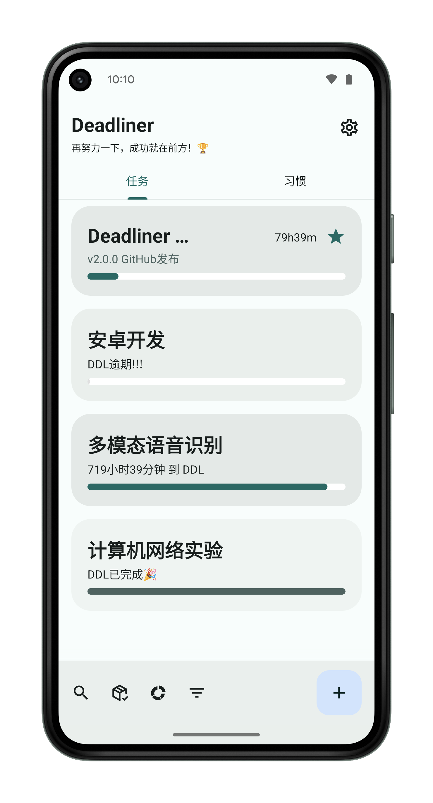
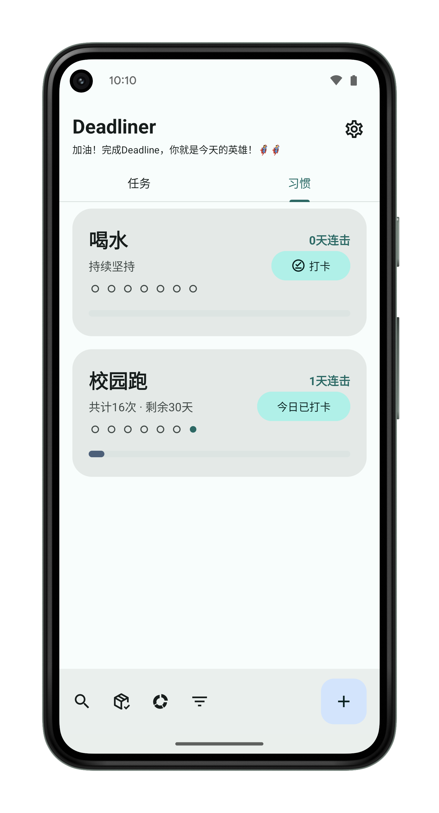
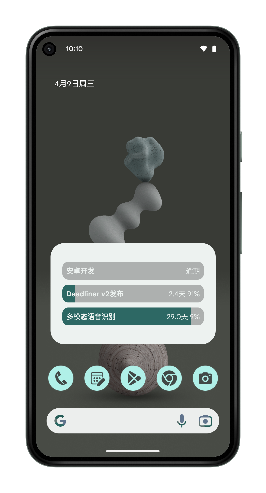
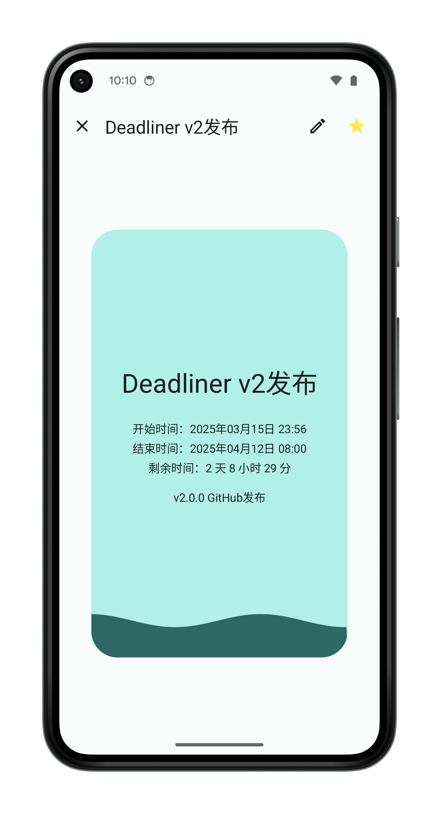
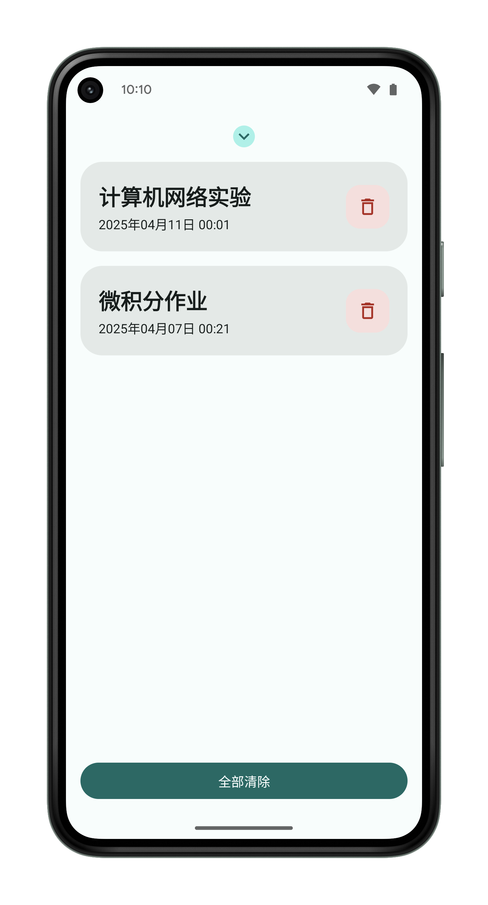
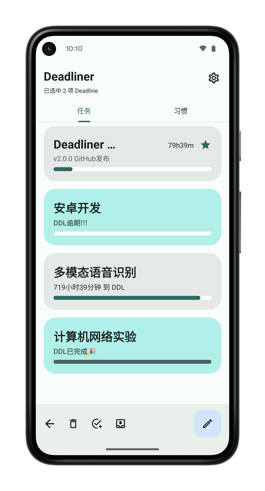
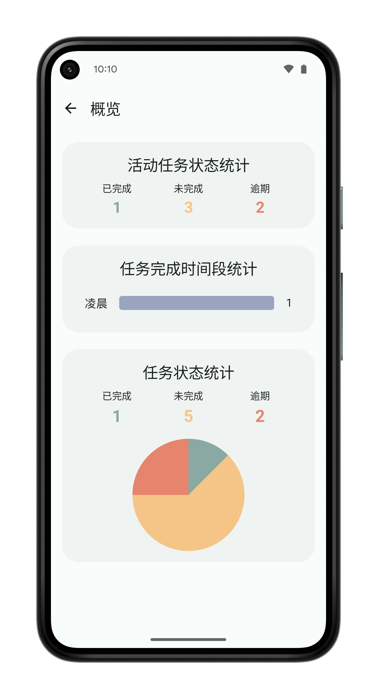
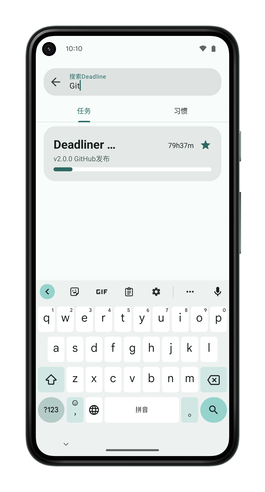

# Deadliner

Deadliner，一款简洁高效的Deadline记录管理软件，灵感来自于作者女朋友的真实需求。

> [!IMPORTANT]
> Since this is my first Android project, I may have used hardcoded strings in some places, which could make translation into other languages more difficult. If you’re interested in localizing this app, feel free to contact me at aritxonly@qq.com for further support.

## 功能

- **添加、编辑、删除**：管理截止（Deadline）和习惯（Habit）项目
- **分类展示**：按类型区分截止与习惯
- **滑动手势**：
  - 向右滑动标记完成（可选彩带动画）
  - 向左滑动删除并进行确认
- **多选操作**：批量标记完成、存档、删除或加星
- **筛选与搜索**：按名称、开始时间或已过时间筛选
- **概览视图**：显示即将到期的截止并倒计时
- **存档视图**：查看已归档的项目
- **快捷设置面板**：通过 Android 快捷设置快速添加项目
- **桌面小组件**：展示多个即将到期的项目
- **后台通知**：使用 WorkManager 周期性检查并发送通知，可配置触发条件
- **应用内更新检查**：从 GitHub 拉取最新发布信息并提示下载／安装
- **引导教程**：首次启动时展示多页使用教程
- **自定义界面**：浅色／深色模式、主题配色、振动反馈、动画效果
- **数据备份与恢复**：基于 Android Backup 实现数据持久化

## 截图



## 技术栈

- **Kotlin** — 主开发语言
- **Android SDK** — 最低 API 31，目标 API 34
- **Jetpack Compose** & **ViewBinding**
- **AndroidX**：AppCompat、Core KTX、ConstraintLayout、Navigation、Lifecycle、WorkManager、SwipeRefreshLayout
- **Material3**：Android Material 组件与 Compose Material3
- **WorkManager**：周期性后台任务管理
- **SQLite**：自定义 DatabaseHelper
- **OkHttp** & **Gson**：网络请求与 JSON 解析
- **Markwon**：Markdown 渲染
- **Konfetti**：彩带动画展示

## 安装

1. 克隆仓库：
   ```bash
   git clone https://github.com/AritxOnly/Deadliner.git
   ```
2. 在 Android Studio（Arctic Fox 或更高版本）中打开项目
3. 运行于 Android 12+（API 31）设备或模拟器

## 使用说明

1. 首次启动时授权 **通知**、**振动** 和 **安装应用** 权限
2. 完成引导教程
3. 点击右下角 **+** 按钮或使用快捷设置添加截止/习惯
4. **向右滑动** 标记完成（可选彩带动画）
5. **向左滑动** 删除并确认
6. 通过底部导航切换 **截止**、**习惯**、**概览**、**存档**、**设置**
7. **长按** 进入多选模式，进行批量操作
8. 下拉刷新以手动重载数据
9. 在 **设置** 中自定义通知、振动、主题、动画等选项

## 贡献

欢迎任何形式的贡献！请提交 Issue 或 Pull Request，以改进功能或修复 Bug。

## 跨平台

🚀 [**Deadliner-Web 正在开发中**](https://github.com/AritxOnly/Deadliner-Web)：基于Flutter的跨平台APP，后端使用Node.js和Python Flask构建（暂未开放）

## 许可证

本项目基于 MIT 许可证，详情请参见 [LICENSE](LICENSE)。
